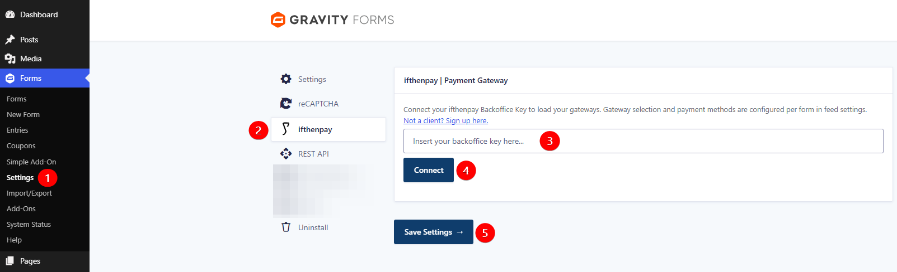
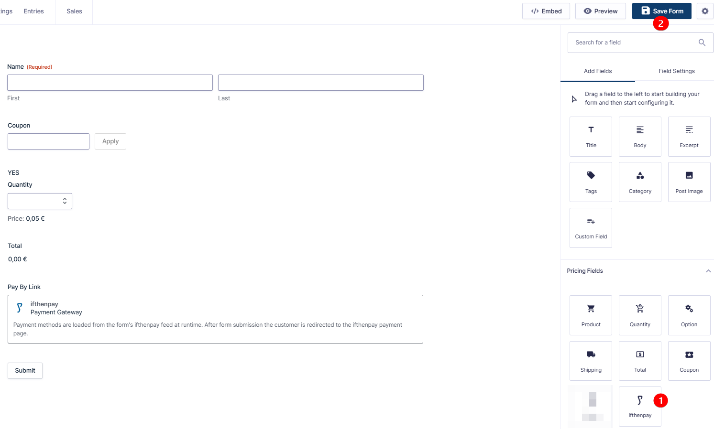
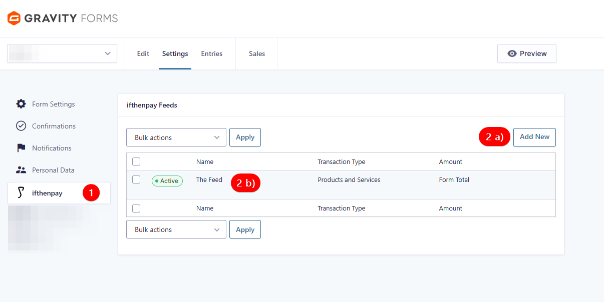
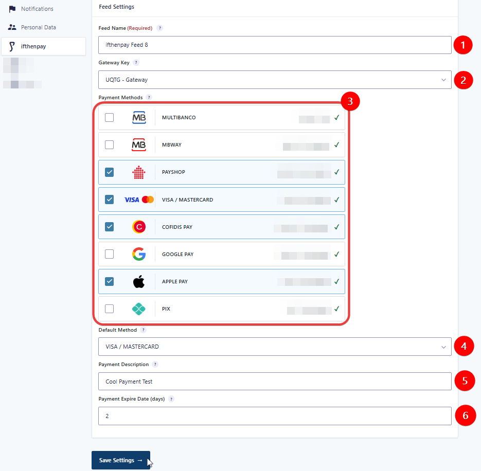
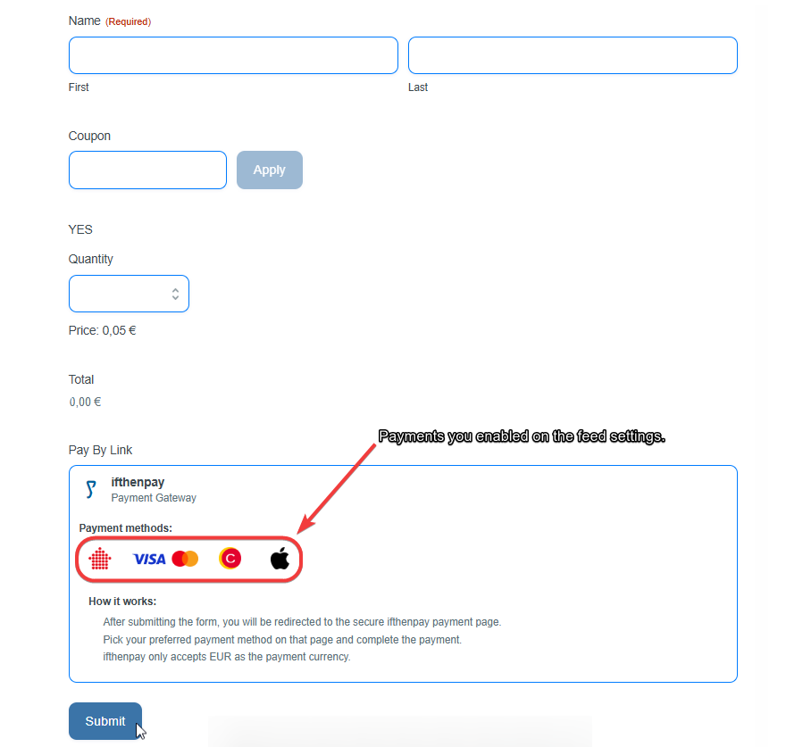
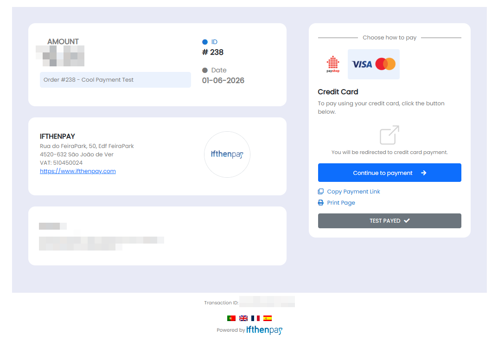
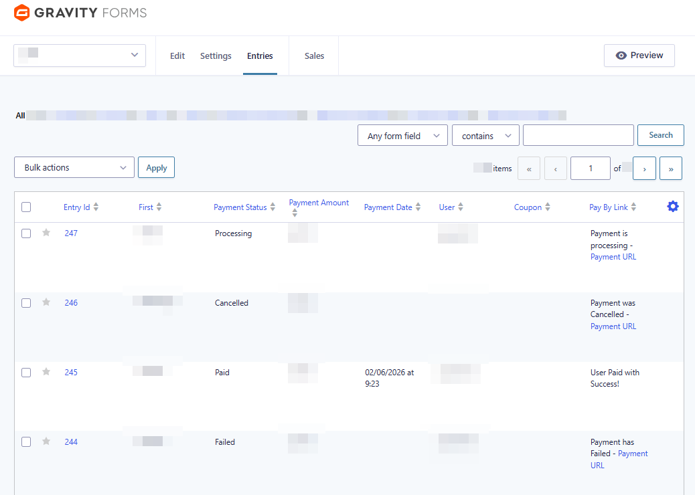

# ifthenpay | Payments for GravityForms

Adds ifthenpay payment methods to GravityForms: cards, wallets, and local payment options; supports secure one-time payments via pay-by-link.

---

## Table of Contents

- [Description](#description)
- [Key Features](#key-features)
- [Requirements](#requirements)
- [Installation](#installation)
- [Form Setup](#form-setup)
- [Frequently Asked Questions](#frequently-asked-questions)
- [External Services](#external-services)
- [Screenshots](#screenshots)
- [Support](#support)

## Description

This plugin integrates the ifthenpay payment gateway with GravityForms to enable seamless payment collection directly from your forms.

Payments are processed through a secure pay-by-link system, ensuring that no sensitive card or banking data is stored on your website.

Customers complete payments using their preferred payment method through a secure payment page. After form submission, users are redirected to the payment window where they finalize the transaction. ifthenpay then sends a server-side callback to automatically update the payment status inside GravityForms.


### In plain terms you get:

* One-time payments directly from GravityForms
* Support for coupons and automatic total calculations
* Merchant backoffice (basic sales) on web + mobile
* Secure automatic payment confirmations
* No card numbers stored on your website

All settings are configured directly in GravityForms and the ifthenpay Backoffice. The plugin is designed so site owners can manage payments without requiring deep technical knowledge.

## Key Features

1. Full integration with GravityForms lite and pro payment fields
2. Secure transactions
3. Automatic payment confirmation (fast access)
4. Support for multiple payment methods (cards, wallets, transfers)
5. Real-time payment status in GravityForms
6. Multi-language support (EN, ES, FR, PT)
7. Security-first approach (no card data stored)

## Requirements

* An active ifthenpay merchant account — [subscribe here](https://ifthenpay.com/aderir/) to obtain your credentials.
* The payment methods you want enabled (our helpdesk team will guide you).
* WordPress 6.5+.
* PHP 8.2+.
* GravityForms installed and activated.
* HTTPS (SSL) enabled on your site.

## Installation

1. Install: Upload the plugin zip via ```Plugins → Add New → Upload, or install``` from WordPress.org and Activate.
2. Credentials: Ensure your ifthenpay account has an active GravityForms Gateway Key with desired payment methods enabled.
3. Setup: Go to ```GravityForms → Settings → Ifthenpay and enter your Backoffice Key```.
4. Form config: Create/Edit a form → Settings → Ifthenpay → "Add New" Feed and select a Gateway Key.

## Frequently Asked Questions

<details>
<summary><strong>Does this plugin require GravityForms?</strong></summary>

Yes. GravityForms must be installed and active to use this plugin.

Without GravityForms, this plugin becomes useless...

</details>

<details>
<summary><strong>Does it support recurring payments?</strong></summary>

No. This version supports one-time payments via pay-by-link only.

</details>

<details>
<summary><strong>Are payment details stored?</strong></summary>

No. The plugin does not store card numbers or full bank details.

Only the minimal references required for payment matching and status updates are stored.

</details>

<details>
<summary><strong>Which payment methods are supported?</strong></summary>

Any ifthenpay method attached to your Gateway Key, including:

* Multibanco
* MB WAY
* Payshop
* Credit Card
* Cofidis
* Google Pay
* Apple Pay
* Pix

</details>

<details>
<summary><strong>How does the payment process work?</strong></summary>

After form submission, users are redirected to a secure payment page hosted by ifthenpay.

Once payment is completed, the payment status is updated automatically via callback.

</details>

<details>
<summary><strong>What happens if a payment fails?</strong></summary>

The GravityForms entry is marked as Failed.

Depending on your configuration, users may retry the payment.

</details>

<details>
<summary><strong>Can I customize the payment experience?</strong></summary>

Yes. You can configure display mode, button labels, descriptions, and styling options directly within GravityForms.

</details>

<details>
<summary><strong>Is there a sandbox?</strong></summary>

ifthenpay may provide test entities for development and testing purposes.

If unavailable, we recommend using a low-value live transaction.

</details>

<details>
<summary><strong>How secure is the integration?</strong></summary>

All requests are encrypted over HTTPS and no sensitive payment data is stored on your website.

</details>

## External Services

This plugin integrates with the ifthenpay payment platform to process payments for GravityForms submissions. ifthenpay is a third-party service that provides secure payment processing for cards, wallets, and local bank transfers.

- **GravityForms**
  - **What it is and what it is used for**: A form builder plugin used to create payment forms. This plugin extends its payment capabilities.

- **ifthenpay Backoffice & Integrations**
  - **What it is and what it is used for**: The ifthenpay Backoffice is the merchant dashboard used to manage integrations and payment configurations. The plugin uses the ifthenpay API to generate payment links and validate transactions.
  - **What data is sent and when**:
    - During setup: Backoffice Key and Gateway Key for authentication and configuration retrieval.
    - During payment processing: Transaction ID, amount, description, enabled payment method accounts, success/error/cancel return URLs, language, and optionally the selected payment method, customer email, customer name, and form field data.
    - During callbacks: Payment status, Transaction ID, and payment method.
  - **End-User License Agreement (EULA)**: [EULA](https://ifthenpay.com/eula/)
  - **Privacy Policy**: [Privacy Policy](https://ifthenpay.com/politica-de-privacidade/)

All network requests are performed server-side over HTTPS. Sensitive credentials are stored securely and are not publicly exposed. No raw card or bank details are stored.

## Screenshots

Below are screenshots demonstrating key features and interfaces of the plugin:

1. **(Admin Only) Backoffice Synchronization (GravityForms Settings -> Ifthenpay)**
   
2. **(Admin Only) Adding ifthenpay's Payment field to the selected form**
   
3. **(Admin Only) GravityForms's Form Feed Settings (Creation/Editing Form -> Settings)**
   
4. **(Admin Only) ifthenpay's Gateway Configuration on a Feed Setting**
   
5. **(Customers Experience) Payment Gateway field display varies by GravityForms settings**
   
6. **(Customers Experience) Payment Window**
   
7. **(Admin Only) Payment Entries**
   

## Support

For assistance use the [WordPress.org support forum](https://wordpress.org/support):

Pre-checks:

- Payment method enabled on Gateway Key AND mapped to Integration
- Running current recommended versions of WordPress, PHP, & GravityForms

Commercial helpdesk available (no direct email required): [helpdesk.ifthenpay.com](https://helpdesk.ifthenpay.com/)

- **ifthenpay support**: [suporte@ifthenpay.com](mailto:suporte@ifthenpay.com)
- **GravityForms docs**: [GravityForms docs](https://gravityforms.com/docs/)
